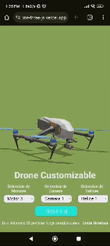

# Drone - ThreJs - Gsap

| PC                                                                                                                                          | Movil                                                                                                                                       |
| ---------------------------------------------------------------------------------------------------------------------------------------------- | --------------------------------------------------------------------------------------------------------------------------------------------- |
|  |  |

Ver en [Netlify](https://drone-three-js.vercel.app/)

## 🚀 Drone 3D con ThreeJs - GSAP

Practicas he inicio de mi nueva forma de trabajar con desarrollo web 3D

## 💯 Features

- Bellas animcaciones
- Transición Suave
- Totalmente Responsivo

## Instalación

Solo debes copiar el repositorio tal como muestra la imagen

  

luego ve a la terminal y haz un git clone tal como muestra la imagen

  

Ingresas a la carpeta descargada (clonada) y ejecutala con **npm run start**

## Happy Coding

Sientete libre de hacer los cambios que creas pertinentes.
